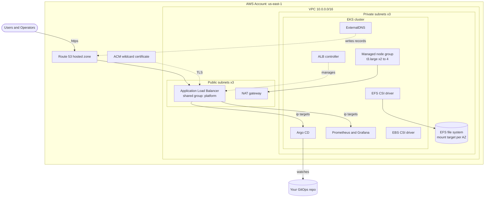
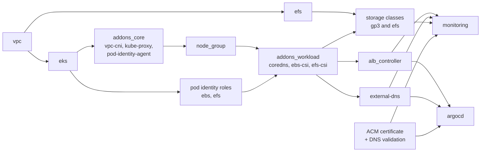

<div align="center">

# EKS Platform

**A production-style Amazon EKS platform, built entirely with Terraform.**
One `terraform apply` gives you a VPC, an EKS cluster, managed nodes, persistent storage, HTTPS ingress with automatic DNS, GitOps with Argo CD, and a full Prometheus + Grafana monitoring stack.


</div>

---

## Table of contents

1. [What you get](#what-you-get)
2. [Architecture](#architecture)
3. [Repository layout](#repository-layout)
4. [Prerequisites](#prerequisites)
5. [Quick start](#quick-start)
6. [Configuration reference](#configuration-reference)
7. [How it works, module by module](#how-it-works-module-by-module)
8. [Using the platform](#using-the-platform)
9. [Cost](#cost)
10. [Security notes](#security-notes)
11. [Tearing it down](#tearing-it-down)
12. [Troubleshooting](#troubleshooting)
13. [Adding another environment](#adding-another-environment)

---

## What you get

| Layer | What is created | Why it matters |
|---|---|---|
| **Network** | VPC, 3 public + 3 private subnets across 3 AZs, Internet Gateway, NAT gateway, per-AZ route tables | Nodes run in private subnets. Load balancers live in public subnets. |
| **Cluster** | EKS control plane (Kubernetes 1.35), IAM role, CloudWatch control plane logs, API-based access entries | Modern access model, no `aws-auth` ConfigMap. |
| **Compute** | Managed node group (Amazon Linux 2023, `t3.large`, 2 to 4 nodes) | Auto-registered nodes with the right IAM policies. |
| **Add-ons** | `vpc-cni`, `kube-proxy`, `eks-pod-identity-agent`, `coredns`, `aws-ebs-csi-driver`, `aws-efs-csi-driver` | Installed as EKS managed add-ons, in the right order. |
| **IAM for pods** | EKS **Pod Identity** roles for EBS CSI, EFS CSI, ExternalDNS and the ALB controller | Least privilege per workload. No OIDC provider, no annotations on service accounts. |
| **Storage** | `gp3` StorageClass (EBS, encrypted) and `efs` StorageClass (shared, `ReadWriteMany`) | Databases get fast block disks. Shared files get EFS. |
| **Ingress** | AWS Load Balancer Controller, one shared ALB for all your apps | HTTPS with real certificates. |
| **DNS + TLS** | ACM wildcard certificate (DNS validated) and ExternalDNS | Create an Ingress with a hostname and the Route 53 record appears by itself. |
| **GitOps** | Argo CD at `https://argocd.<your-domain>` with an optional app-of-apps root application | Push manifests to Git, the cluster follows. |
| **Observability** | `kube-prometheus-stack` (Prometheus, Alertmanager, Grafana, exporters) at `https://grafana.<your-domain>` | Metrics and dashboards from day one. |

---

## Architecture



### Apply order

Terraform builds this in dependency order. The order matters because EKS is created with `bootstrap_self_managed_addons = false`, so nothing runs until you install the add-ons yourself.



Why the add-ons are split in two:

* **Core** (`vpc-cni`, `kube-proxy`, `eks-pod-identity-agent`) must exist **before** nodes, otherwise nodes cannot become `Ready`.
* **Workload** (`coredns`, CSI drivers) need running nodes to schedule onto, and the CSI drivers also need their Pod Identity roles first.

---

## Repository layout

```
Eks-platform/
├── README.md
├── .gitignore
├── envs/
│   └── dev/                         # The environment you actually deploy
│       ├── backend.tf               # S3 remote state (partial config, no bucket name)
│       ├── backend.hcl.example      # Copy to backend.hcl and set your bucket
│       ├── versions.tf              # Terraform, provider versions and provider config
│       ├── variables.tf             # Input variables
│       ├── terraform.tfvars.example # Copy to terraform.tfvars and edit
│       ├── main.tf                  # Wires all modules together
│       ├── dns.tf                   # ACM certificate, ExternalDNS
│       ├── storage.tf               # gp3 and efs StorageClasses
│       ├── ouputs.tf                # Outputs (URLs, cluster name, Grafana password)
│       └── .terraform.lock.hcl      # Pinned provider versions (commit this)
└── modules/                         # Reusable building blocks
    ├── vpc/                         # VPC, subnets, NAT, routing
    ├── eks-cluster/                 # Control plane, IAM, logs, access entries
    ├── addons/                      # Generic EKS managed add-on installer
    ├── node-group/                  # Managed node group and node IAM role
    ├── pod-identity/                # IAM role + Pod Identity association
    ├── efs/                         # EFS file system, security group, mount targets
    ├── alb-controller/              # AWS Load Balancer Controller (Helm)
    ├── argocd/                      # Argo CD (Helm) and optional root app
    └── monitoring/                  # kube-prometheus-stack (Helm)
```

---

## Prerequisites

| Tool | Version | Used for |
|---|---|---|
| [Terraform](https://developer.hashicorp.com/terraform/install) | `>= 1.10` | Required for S3-native state locking (`use_lockfile`) |
| [AWS CLI](https://aws.amazon.com/cli/) | v2 | Terraform's Kubernetes and Helm providers call `aws eks get-token` to authenticate |
| [kubectl](https://kubernetes.io/docs/tasks/tools/) | matches cluster | Talking to the cluster |
| AWS credentials | with admin-level rights | Creating VPC, EKS, IAM, EFS, ACM, Route 53 records |

You also need two things that **already exist** in your AWS account. Terraform does not create them:

1. **A public Route 53 hosted zone** for your domain (for example `example.com`). The code looks it up with a data source and fails if it is not found.
2. **An S3 bucket for Terraform state.** See the bootstrap step below.

> **Important:** `aws` must be on your `PATH` when you run Terraform. The Helm and Kubernetes providers shell out to it to get a cluster token.

---

## Quick start

### 1. Clone

```bash
git clone https://github.com/<your-user>/<your-repo>.git
cd <your-repo>/envs/dev
```

### 2. Authenticate to AWS

```bash
aws configure            # or: aws sso login --profile <profile>
aws sts get-caller-identity   # confirm you are who you think you are
```

### 3. Create the state bucket (one time)

Pick a globally unique name. Versioning is strongly recommended so you can recover a bad state file.

```bash
BUCKET=my-unique-terraform-state-bucket

aws s3api create-bucket --bucket $BUCKET --region us-east-1
aws s3api put-bucket-versioning --bucket $BUCKET \
  --versioning-configuration Status=Enabled
aws s3api put-bucket-encryption --bucket $BUCKET \
  --server-side-encryption-configuration \
  '{"Rules":[{"ApplyServerSideEncryptionByDefault":{"SSEAlgorithm":"AES256"}}]}'
aws s3api put-public-access-block --bucket $BUCKET \
  --public-access-block-configuration \
  BlockPublicAcls=true,IgnorePublicAcls=true,BlockPublicPolicy=true,RestrictPublicBuckets=true
```

Then tell Terraform which bucket to use. **Backend blocks cannot use variables**, so this repo uses a *partial backend configuration*: [`backend.tf`](envs/dev/backend.tf) holds only the non-sensitive settings, and your bucket name goes in a separate, git-ignored `backend.hcl` file.

```bash
cp backend.hcl.example backend.hcl
```

Edit `backend.hcl`:

```hcl
bucket = "my-unique-terraform-state-bucket"
key    = "eks-platform/dev/terraform.tfstate"
region = "us-east-1"
```

`backend.tf` stays in Git and looks like this:

```hcl
terraform {
  backend "s3" {
    encrypt      = true
    use_lockfile = true      # S3-native locking, no DynamoDB table needed
  }
}
```

### 4. Configure your variables

```bash
cp terraform.tfvars.example terraform.tfvars
```

At minimum, change `domain_name` to your own Route 53 zone. Everything else has sensible defaults. See the [configuration reference](#configuration-reference).

### 5. Deploy

```bash
terraform init -backend-config=backend.hcl
terraform plan -out=tfplan
terraform apply tfplan
```

> **Windows PowerShell 5.1:** it splits unquoted `-flag=file.ext` arguments at the dot. Quote it: `terraform init "-backend-config=backend.hcl"`. PowerShell 7 and Git Bash are not affected.

The first apply takes roughly **20 to 30 minutes**. The EKS control plane alone takes about 10 minutes, and the Helm charts wait for pods to become healthy.

### 6. Connect to the cluster

```bash
aws eks update-kubeconfig --region us-east-1 --name platform-dev-eks
kubectl get nodes
kubectl get pods -A
```

### 7. Log in to the tools

```bash
terraform output argocd_url
terraform output grafana_url
```

| Tool | URL | Username | Password |
|---|---|---|---|
| **Grafana** | `https://grafana.<your-domain>` | `admin` | `terraform output -raw grafana_admin_password` |
| **Argo CD** | `https://argocd.<your-domain>` | `admin` | see below |

Argo CD generates its initial admin password on first start:

```bash
# macOS / Linux / Git Bash
kubectl -n argocd get secret argocd-initial-admin-secret \
  -o jsonpath="{.data.password}" | base64 -d
```

```powershell
# Windows PowerShell
$b64 = kubectl -n argocd get secret argocd-initial-admin-secret -o jsonpath="{.data.password}"
[Text.Encoding]::UTF8.GetString([Convert]::FromBase64String($b64))
```

> DNS records are created by ExternalDNS after the ALB is provisioned, so give it a minute or two after the apply finishes before the URLs resolve.

---

## Configuration reference

All inputs live in [`envs/dev/variables.tf`](envs/dev/variables.tf) and are set in `terraform.tfvars`.

| Variable | Type | Default | Description |
|---|---|---|---|
| `region` | `string` | none (required) | AWS region. |
| `name` | `string` | none (required) | Prefix for VPC, EFS and related resource names. |
| `cluster_name` | `string` | none (required) | EKS cluster name. Also used to name IAM roles and tag subnets. |
| `vpc_cidr` | `string` | none (required) | CIDR block for the VPC. |
| `azs` | `list(string)` | none (required) | Availability zones. One public and one private subnet is created per AZ. |
| `public_subnet_cidrs` | `list(string)` | none (required) | One CIDR per AZ, same order as `azs`. |
| `private_subnet_cidrs` | `list(string)` | none (required) | One CIDR per AZ, same order as `azs`. |
| `single_nat_gateway` | `bool` | `true` | `true` = one shared NAT (cheap). `false` = one NAT per AZ (resilient). |
| `kubernetes_version` | `string` | none (required) | EKS Kubernetes version, for example `"1.35"`. |
| `admin_principal_arns` | `list(string)` | `[]` | Extra IAM users or roles to grant cluster admin. The identity that runs Terraform is always admin. |
| `node_instance_types` | `list(string)` | none (required) | EC2 instance types for the node group. |
| `node_desired_size` | `number` | none (required) | Starting node count. |
| `node_min_size` | `number` | none (required) | Autoscaling floor. |
| `node_max_size` | `number` | none (required) | Autoscaling ceiling. |
| `domain_name` | `string` | none (required) | Existing public Route 53 zone. The apex and `*.domain` are covered by one certificate. |
| `gitops_repo_url` | `string` | `null` | Git repo for Argo CD to watch. `null` installs Argo CD with no repo connected. |
| `gitops_repo_revision` | `string` | `"main"` | Branch, tag or commit to track. |
| `gitops_repo_path` | `string` | `"apps"` | Directory in the repo containing your Kubernetes manifests or Argo CD `Application`s. |

### Outputs

| Output | Description |
|---|---|
| `cluster_name` | EKS cluster name, handy for `aws eks update-kubeconfig`. |
| `efs_file_system_id` | EFS ID, for static PersistentVolumes. |
| `argocd_url` | `https://argocd.<domain>` |
| `grafana_url` | `https://grafana.<domain>` |
| `grafana_admin_password` | Sensitive. Read it with `terraform output -raw grafana_admin_password`. |

---

## How it works, module by module

### `modules/vpc`

Creates the network foundation.

* VPC with DNS support and DNS hostnames enabled (required by EKS and EFS).
* One **public** subnet and one **private** subnet per AZ.
* Public subnets are tagged `kubernetes.io/role/elb=1` so the ALB controller places internet-facing load balancers there. Private subnets get `kubernetes.io/role/internal-elb=1` for internal ones. Both carry `kubernetes.io/cluster/<name>=shared`.
* Internet Gateway for the public route table.
* NAT gateway(s) with Elastic IPs. `single_nat_gateway = true` builds one NAT and every private route table points to it. `false` builds one per AZ and each AZ uses its own.
* One private route table per AZ, so switching to per-AZ NAT needs no restructuring.

### `modules/eks-cluster`

Creates the control plane.

* Cluster IAM role with `AmazonEKSClusterPolicy`.
* CloudWatch log group with 30-day retention. The `api`, `audit` and `authenticator` log types are enabled.
* **Authentication mode `API`** with `bootstrap_cluster_creator_admin_permissions = true`. Access is managed through EKS access entries instead of the legacy `aws-auth` ConfigMap. Whoever runs Terraform is automatically cluster admin.
* Endpoint is reachable both privately (from inside the VPC) and publicly. Public access is limited by `public_access_cidrs`, which defaults to `0.0.0.0/0`. See [Security notes](#security-notes).
* `bootstrap_self_managed_addons = false`, so add-ons are installed explicitly by the `addons` module.
* Optional extra admins: each ARN in `admin_principal_arns` gets an access entry plus the `AmazonEKSClusterAdminPolicy` association.

### `modules/addons`

A tiny, reusable wrapper around `aws_eks_addon`. Pass a list of names and it installs each one, using `OVERWRITE` for conflict resolution. It is used twice in `main.tf`, once before the node group and once after.

### `modules/node-group`

* Node IAM role with `AmazonEKSWorkerNodePolicy`, `AmazonEKS_CNI_Policy` and `AmazonEC2ContainerRegistryPullOnly`.
* Managed node group using `AL2023_x86_64_STANDARD`, `ON_DEMAND` capacity, 50 GB disks, and `max_unavailable = 1` during rolling updates.
* Scaling comes from `node_desired_size`, `node_min_size` and `node_max_size`.

> This sets the node group's size range but does not install Cluster Autoscaler or Karpenter. Nodes will not scale by themselves until you add one.

### `modules/pod-identity`

The pattern used for every workload that needs AWS permissions.

* Creates an IAM role trusted by `pods.eks.amazonaws.com`.
* Attaches any managed policies from `policy_arns` and, optionally, a custom `inline_policy`.
* Creates an `aws_eks_pod_identity_association` linking the role to a `namespace/service_account`.

Roles created in this repo:

| Role | Namespace / ServiceAccount | Permissions |
|---|---|---|
| `<cluster>-ebs-csi` | `kube-system/ebs-csi-controller-sa` | `AmazonEBSCSIDriverPolicy` |
| `<cluster>-efs-csi` | `kube-system/efs-csi-controller-sa` | `AmazonEFSCSIDriverPolicy` |
| `<cluster>-external-dns` | `external-dns/external-dns` | Change records in **your one hosted zone only**, plus list permissions |
| `<cluster>-alb-controller` | `kube-system/aws-load-balancer-controller` | Official policy from [`iam_policy.json`](modules/alb-controller/iam_policy.json) |

Pod Identity is simpler than IRSA: no OIDC provider to manage and no `eks.amazonaws.com/role-arn` annotation on service accounts.

### `modules/efs`

* Encrypted EFS file system in `generalPurpose` mode with `elastic` throughput (pay for what you use).
* A mount target in every private subnet.
* A security group that allows **TCP 2049 (NFS) only from the EKS cluster security group**, which is the group your nodes use.

### `envs/dev/storage.tf`

Two StorageClasses:

| Class | Backend | Binding | Use it for |
|---|---|---|---|
| `gp3` | EBS gp3, encrypted, expandable | `WaitForFirstConsumer` (volume is created in the same AZ as the pod) | Prometheus, Grafana, databases. Single-pod, `ReadWriteOnce`. |
| `efs` | EFS access points, `/dynamic` base path, `700` perms | `Immediate` | Shared files across pods and AZs. `ReadWriteMany`. |

Both use `reclaimPolicy: Delete`, so deleting a PVC deletes its data. Change this to `Retain` for anything you cannot afford to lose.

### `envs/dev/dns.tf`

* Looks up your existing public hosted zone.
* Requests one ACM certificate for the apex **and** `*.<domain>`, validated automatically with DNS records that Terraform writes into the zone.
* Installs **ExternalDNS** via Helm, watching `ingress` and `service` sources. It uses `policy = sync`, so it will also **delete** records it created when the matching Ingress goes away. `txtOwnerId` is set to the cluster name so it only touches records it owns.

### `modules/alb-controller`

Installs the AWS Load Balancer Controller with Helm (2 replicas) using the Pod Identity role above. Any `Ingress` with `ingressClassName: alb` becomes a real Application Load Balancer.

### `modules/argocd`

* Installs Argo CD at `argocd.<domain>` behind the ALB.
* `server.insecure = true` because TLS is terminated at the ALB. Traffic from the ALB to the pod is plain HTTP inside the VPC.
* Dex (SSO) is disabled to keep things lean.
* **Optional GitOps bootstrap.** If `gitops_repo_url` is set, a second Helm release (`argocd-apps`) creates a root `Application` that:
  * watches `gitops_repo_path` on `gitops_repo_revision`,
  * recurses into subdirectories,
  * has `prune` and `selfHeal` on, so the cluster always converges to what is in Git.

### `modules/monitoring`

* Installs `kube-prometheus-stack` in the `monitoring` namespace.
* Generates a random 24-character Grafana admin password (kept in Terraform state, exposed as a sensitive output).
* Disables scraping of `kubeEtcd`, `kubeControllerManager`, `kubeScheduler` and `kubeProxy`. On EKS the control plane is managed by AWS and those endpoints are not reachable, so leaving them on only produces false alerts.
* Prometheus keeps **15 days** of data on a **30 GiB** gp3 volume. Grafana gets a **10 GiB** gp3 volume so dashboards survive restarts.
* Prometheus discovers `ServiceMonitor` and `PodMonitor` objects from **every namespace**, so your own apps can be scraped without touching this module.

### One ALB for everything

Argo CD and Grafana both set `alb.ingress.kubernetes.io/group.name = platform`. Ingresses in the same group share **a single ALB**, which saves the monthly cost of a load balancer per service. Use the same group name on your own apps to reuse it too.

---

## Using the platform

### Deploy an app with a public HTTPS URL

Apply this (or commit it to your GitOps repo). The ALB, the DNS record and TLS are all created for you.

```yaml
apiVersion: apps/v1
kind: Deployment
metadata:
  name: hello
spec:
  replicas: 2
  selector:
    matchLabels: { app: hello }
  template:
    metadata:
      labels: { app: hello }
    spec:
      containers:
        - name: hello
          image: nginxdemos/hello
          ports:
            - containerPort: 80
---
apiVersion: v1
kind: Service
metadata:
  name: hello
spec:
  selector: { app: hello }
  ports:
    - port: 80
      targetPort: 80
---
apiVersion: networking.k8s.io/v1
kind: Ingress
metadata:
  name: hello
  annotations:
    alb.ingress.kubernetes.io/scheme: internet-facing
    alb.ingress.kubernetes.io/target-type: ip
    alb.ingress.kubernetes.io/group.name: platform          # share the existing ALB
    alb.ingress.kubernetes.io/listen-ports: '[{"HTTP":80},{"HTTPS":443}]'
    alb.ingress.kubernetes.io/ssl-redirect: "443"
    alb.ingress.kubernetes.io/certificate-arn: <ACM cert ARN>   # from the AWS console or `terraform state show aws_acm_certificate.this`
spec:
  ingressClassName: alb
  rules:
    - host: hello.example.com          # must be under your domain_name
      http:
        paths:
          - path: /
            pathType: Prefix
            backend:
              service:
                name: hello
                port:
                  number: 80
```

Within a couple of minutes `https://hello.example.com` resolves and serves over TLS.

### Persistent storage

**Block storage (single pod, fastest):**

```yaml
apiVersion: v1
kind: PersistentVolumeClaim
metadata:
  name: data
spec:
  accessModes: [ReadWriteOnce]
  storageClassName: gp3
  resources:
    requests:
      storage: 20Gi
```

**Shared storage (many pods, many AZs):**

```yaml
apiVersion: v1
kind: PersistentVolumeClaim
metadata:
  name: shared
spec:
  accessModes: [ReadWriteMany]
  storageClassName: efs
  resources:
    requests:
      storage: 5Gi        # required by the API, EFS itself is elastic
```

### GitOps with Argo CD

1. Create a Git repo with a folder, for example `apps/`, containing Kubernetes manifests or Argo CD `Application` objects.
2. Set these in `terraform.tfvars`:
   ```hcl
   gitops_repo_url      = "https://github.com/<you>/<gitops-repo>.git"
   gitops_repo_revision = "main"
   gitops_repo_path     = "apps"
   ```
3. Run `terraform apply`.

From then on, `git push` is your deploy. Argo CD detects the change, syncs it, and reverts any manual drift.

> The root application uses an unauthenticated HTTPS URL, so the repo must be **public** or you must add repository credentials to Argo CD yourself (Settings > Repositories in the UI, or a `Secret` labelled `argocd.argoproj.io/secret-type: repository`).

### Monitoring your own app

Expose a `/metrics` endpoint and add a `ServiceMonitor` in any namespace:

```yaml
apiVersion: monitoring.coreos.com/v1
kind: ServiceMonitor
metadata:
  name: my-app
spec:
  selector:
    matchLabels: { app: my-app }
  endpoints:
    - port: http
      path: /metrics
```

It appears in Prometheus automatically. Query it from Grafana's **Explore** tab. The stack ships with ready-made Kubernetes dashboards under **Dashboards**.

### Giving your own workload AWS permissions

Reuse the `pod-identity` module. Example: let a pod read one S3 bucket.

```hcl
module "pi_my_app" {
  source = "../../modules/pod-identity"

  cluster_name    = module.eks.cluster_name
  role_name       = "${var.cluster_name}-my-app"
  namespace       = "default"
  service_account = "my-app"

  inline_policy = jsonencode({
    Version = "2012-10-17"
    Statement = [{
      Effect   = "Allow"
      Action   = ["s3:GetObject"]
      Resource = ["arn:aws:s3:::my-bucket/*"]
    }]
  })
}
```

Then run your pod with `serviceAccountName: my-app`. No annotations, no keys.

### Day-two operations

```bash
# Scale the node group: edit node_desired_size / node_max_size, then
terraform apply

# Upgrade Kubernetes: bump kubernetes_version by ONE minor version, then
terraform apply        # control plane first, then node group rolls

# Pin Helm chart versions once you know a working set (all default to latest):
#   modules/alb-controller  -> chart_version
#   modules/argocd          -> chart_version
#   modules/monitoring      -> chart_version
```

---

## Cost

Approximate monthly cost in `us-east-1` with the default settings, running 24/7. Prices change, so use the [AWS Pricing Calculator](https://calculator.aws/) for a real number.

| Item | Approx. monthly |
|---|---|
| EKS control plane | $73 |
| 2 x `t3.large` on-demand | $120 |
| 1 x NAT gateway (plus data processing) | $33 and up |
| Application Load Balancer (shared) | $17 and up |
| EBS (2 x 50 GB node disks, 30 GiB Prometheus, 10 GiB Grafana) | $15 |
| EFS, CloudWatch logs, Route 53 | a few dollars |
| **Total** | **about $260 to $280** |

**Ways to save:** destroy the environment when you are not using it, keep `single_nat_gateway = true`, and consider Spot capacity for non-critical nodes.

---

## Security notes

This is a solid starting point, not a hardened production baseline. Before real workloads, review these:

| Item | Current state | Recommendation |
|---|---|---|
| **Cluster API endpoint** | Public, open to `0.0.0.0/0` (still requires IAM auth) | Set `public_access_cidrs` in the `eks-cluster` module to your office or VPN range, or disable public access. |
| **Argo CD and Grafana** | Internet-facing, protected only by their own logins | Restrict with ALB annotations (`inbound-cidrs`), add SSO/OIDC, or put them on an internal ALB behind a VPN. |
| **Grafana password** | Random, stored in Terraform state | State is encrypted in S3. Keep bucket access tight, and rotate after first login. |
| **Terraform state** | S3 with encryption and lockfile | Enable bucket versioning, block public access, and restrict IAM access to the bucket. |
| **Node access** | Private subnets, no SSH key | Use SSM Session Manager if you need a shell. |
| **Pod IAM** | Pod Identity, one role per workload | Keep policies scoped. Do not attach broad policies to the node role. |
| **Secrets in Git** | Not handled here | Use External Secrets, Sealed Secrets or SOPS. Never commit secrets to your GitOps repo. |

Never commit `*.tfstate`, `terraform.tfvars`, `backend.hcl` or saved plans. The included `.gitignore` already excludes them. Only the `*.example` templates are meant to be shared.

---

## Tearing it down

**Do not just run `terraform destroy` on a live cluster.** Load balancers created by the ALB controller and DNS records created by ExternalDNS are managed by controllers, not by Terraform. If Terraform removes the controllers first, those ALBs can be orphaned and will block deletion of the VPC.

Destroy in this order:

```bash
# 1. Delete anything YOU deployed that creates ALBs, EBS or EFS volumes
kubectl delete ingress --all -A
kubectl delete pvc --all -A

# 2. Remove the apps that own Ingresses, so ExternalDNS cleans up Route 53 and the ALB is deleted
terraform destroy -target=module.argocd -target=module.monitoring

# 3. Wait about 2 minutes, confirm no load balancers remain, then destroy the rest
aws elbv2 describe-load-balancers --query "LoadBalancers[].LoadBalancerName"
terraform destroy
```

The S3 state bucket and the Route 53 hosted zone are not managed here and are left alone.

---

## Troubleshooting

<details>
<summary><strong>Error: no matching Route 53 Hosted Zone found</strong></summary>

`domain_name` must exactly match an existing **public** hosted zone in the same AWS account. Check with:
```bash
aws route53 list-hosted-zones-by-name --dns-name example.com
```
</details>

<details>
<summary><strong>terraform init fails with "Failed to get existing workspaces" or bucket errors</strong></summary>

Either you ran `terraform init` without `-backend-config=backend.hcl`, or the S3 bucket named in `backend.hcl` does not exist, is in a different region, or your credentials cannot access it. Create it (see [Quick start](#3-create-the-state-bucket-one-time)) and make sure `region` in `backend.hcl` matches the bucket's region.
</details>

<details>
<summary><strong>Helm or Kubernetes provider: "executable aws not found" or "Unauthorized"</strong></summary>

The providers run `aws eks get-token`. Make sure the AWS CLI v2 is on your `PATH` and that you are using the **same** AWS credentials that created the cluster (the creator is the bootstrap admin). Add other people through `admin_principal_arns`.
</details>

<details>
<summary><strong>Nodes stay NotReady or the node group fails to become active</strong></summary>

Check the core add-ons (`vpc-cni`, `kube-proxy`, `eks-pod-identity-agent`) were created first. Confirm the private subnets have a route to a NAT gateway so nodes can pull images and reach the EKS API.
</details>

<details>
<summary><strong>Ingress created but no ALB, or ALB but no DNS record</strong></summary>

```bash
kubectl -n kube-system logs deploy/aws-load-balancer-controller
kubectl -n external-dns logs deploy/external-dns
```
Common causes: a missing `ingressClassName: alb`, a hostname outside your `domain_name`, or subnets missing the `kubernetes.io/role/elb` tag.
</details>

<details>
<summary><strong>PVC stuck in Pending</strong></summary>

For `gp3`, the pod must be scheduled first (`WaitForFirstConsumer`). Then check `kubectl -n kube-system logs deploy/ebs-csi-controller`. For `efs`, verify the security group allows NFS from the cluster security group and that mount targets exist in every private subnet.
</details>

<details>
<summary><strong>Lock file warnings on Linux or macOS</strong></summary>

If the lock file was generated on Windows, add the other platforms' hashes:
```bash
terraform providers lock -platform=windows_amd64 -platform=linux_amd64 -platform=darwin_arm64
```
</details>

<details>
<summary><strong>State lock error: "Error acquiring the state lock"</strong></summary>

A previous run was interrupted. If you are sure nobody else is running Terraform: `terraform force-unlock <LOCK_ID>`.
</details>

---

## Adding another environment

The `modules/` folder is environment-agnostic. To add `staging` or `prod`:

```bash
cp -r envs/dev envs/staging
cd envs/staging
rm -rf .terraform
```

Then:

1. Change `key` in `backend.hcl` to `eks-platform/staging/terraform.tfstate`. Each environment must have its own state key.
2. Change `Environment = "staging"` in the `default_tags` block of `versions.tf`.
3. Edit `terraform.tfvars` with a new `name`, `cluster_name`, non-overlapping `vpc_cidr` and its own domain or subdomain.
4. `terraform init -backend-config=backend.hcl && terraform apply`.

For production, also consider `single_nat_gateway = false`, larger or more nodes, a restricted API endpoint, and pinned Helm chart versions.

---

<div align="center">

Built with Terraform, AWS EKS, Helm and a lot of dependency ordering.

</div>